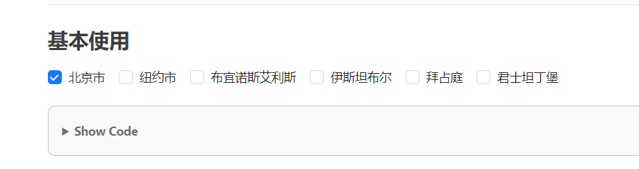

## 解决md文件复选框问题(未解决)
1. vscode里面的md文件的复选框的选择：  
[安装插件](https://marketplace.visualstudio.com/items?itemName=bierner.markdown-checkbox)  
2.不是网页用户可以选择的复选框，对于用户是只读的复选框

3. vuepress解决复选框的
>参考：[f.zuo11.com](http://www.zuo11.com/blog/2020/12/vuepress_tasklist.html)
```js
npm install markdown-it-task-lists -D
 markdown: {
    plugins: ['task-lists']
  },
```
结果是解决不了问题
4. 只读复选框
C:\Users\haobing\Documents\gitmd\git\myblog2\docs\.vitepress\cache\deps\_metadata.json
## 解决ignore的metadata.json文件
## 问题集锦
1. 什么时候给文章加tag？在哪加？这个tag数据怎么存储？
2. 不要自己搭环境，先用现成的环境，将代码写起来。
## 一些想法
>因为后端需要springboot和mysql,没有从0到1的部署教程，所以暂时先搁置这个计划。

1. 波浪的主页
2. 时间段的记事
3. 聊天室
4. 邮箱的注册登录
5. 打字效果的主页
6. 小卡通人物的吉祥物

7. 一个猫咪的进度条挂坠
## ES module和commonjs的区别
在config.ts加一个theme下的posts，用一个getposts()函数来获取posts的数据，然后一直报错。
## 添加了 lastUpdated: true
> [参考网址](https://vitepress.dev/reference/default-theme-last-updated)
bug：所有文章的lastUpdated都是一样的。
## 在部署的时候，必须package-lock.json，pnpm-lock.yaml不行，如何解决这个问题
```yml
name: Deployhaha

on:
  push:
    branches:
      master

jobs:
  deploy:
    runs-on: ubuntu-latest
    steps:
      - uses: actions/checkout@v2
      - uses: actions/setup-node@v3
        with:
          node-version: 16
          cache: pnpm //改了这

      - run: pnpm install --frozen-lockfile //改了

      - name: Build
        run: npm run docs:build

      - name: Deploy
        uses: peaceiris/actions-gh-pages@v3
        with:
          github_token: ${{ secrets.GITHUBTOKEN }}
          publish_dir: docs/.vitepress/dist

```
# ignore添加失效
> [参考网址](https://www.jianshu.com/p/39848b7ecbaa)
> [参考网址](https://www.cnblogs.com/mingc/p/7503100.html)
```js
