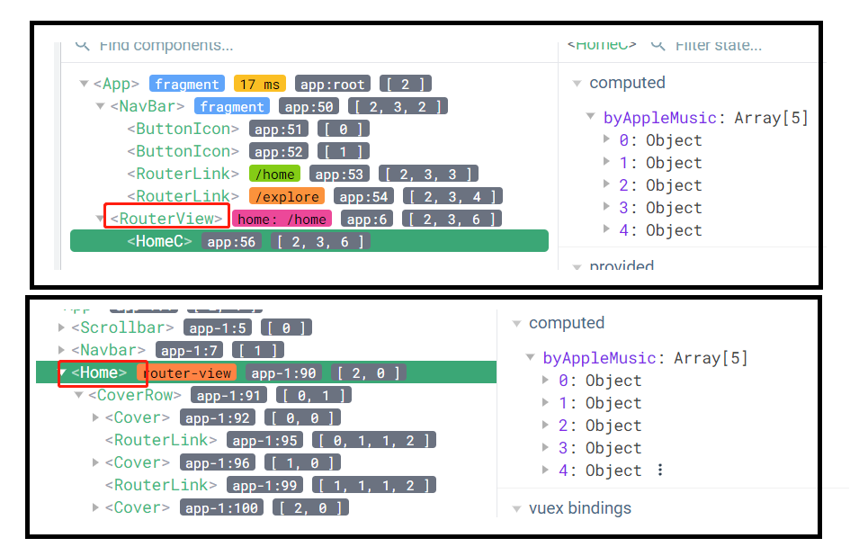

## [启动后端](https://github.com/JaneAnne218/NeteaseCloudMusicApi)

## [启动前端]()

## husky

husky 是一个 git hook 工具，可以在 git hook 之前执行脚本，比如在 commit 之前执行 lint 检查，或者在 push 之前执行测试。

## janeplaymusic

vue-cli vue3+webpack 1.发送 axios 请求
参考 [axios](https://janeanne218.github.io/myblog2/axios.html) 2. 解决同一个组件需要发送多个请求的问题 3. JSON.stringify(response.data, null, 2);
JSON.stringify 是将一个对象转换成 json 字符串，null 是转换过程中的替换函数，2 是缩进用的空格数。
举个例子 JSON.stringify(response.data, null, 2);：

```js
var obj = {
  a: 1,
  b: 2,
};
JSON.stringify(obj, null, 2);
// "{"a":1,"b":2}"
```

## 步骤

axios 请求拿到后端数据，存储在 localstorage，vuex 从 localstorage 拿到数据供组件使用
在 vue devtools，lyrics 下的 R 组件。router-link 这些不知道怎么命名的。
vue-slider

## 二维码登录

axios
登录成功之后返回的 cookie

```json
{
  "code": 800,
  "message": "授权登陆成功",
  "cookie": "MUSIC_U=0sjdh"
}
```

## 播放

```js
http://localhost:20201/api/scrobble?id=2040585410&sourceid=163996627&time=240&timestamp=1691233907759&realIP=211.161.244.70
http://localhost:20201/api/scrobble?id=2040585410&sourceid=163996627&time=0&timestamp=1691233907762&realIP=211.161.244.70
```

1. 播放进度保存了，怎么保存的呢？

## 获取后端数据

```js
Proxy error: Could not proxy request //song/detail?ids=1433929296&realIP=211.161.244.70 from localhost:20201 to http://localhost:3000/.
See https://nodejs.org/api/errors.html#errors_common_system_errors for more information (ECONNREFUSED).
```

## `${img?.replace('http://', 'https://')}?param=512y512`

链接：
'https://p2.music.126.net/GvYQoflE99eoeGi9jG4Bsw==/109951165375336156.jpg'
此表达式处理后为：
https://p2.music.126.net/GvYQoflE99eoeGi9jG4Bsw==/109951165375336156.jpg?param=512y512

1. https://替换了 http://
2. 链接的末尾加了?param=512y512
   这里的?的含义:在 urls 中，?做为分隔符

## svg

svg 在 vue 模板中引用的方法有几种？

1. 直接引用

```html
<svg class="icon" aria-hidden="true">
  <use xlink:href="#icon-xxx"></use>
</svg>
```

2. 通过 js 引用

```js
import xxx from "xxx.svg";
```

3. 通过 css 引用

```css
.xxx {
  background: url(xxx.svg);
}
```

4 通过 img 方式引用

```html

```

## arrow-left arrow-right

1. css <br>
   display 的属性值有哪些？inline、block、inline-block、flex、grid、none <br>
   这些属性值有什么区别呢？<br>
   inline：内联元素，不会独占一行，会在一行显示，不会换行，宽高无效，margin 和 padding 的上下无效，左右有效<br>
   block：块级元素，会独占一行，会换行，宽高有效，margin 和 padding 的上下左右都有效<br>
   inline-block：内联块级元素，不会独占一行，会在一行显示，不会换行，宽高有效，margin 和 padding 的上下左右都有效<br>

   flex：弹性布局，可以实现弹性布局。<br>
   grid：网格布局，可以实现网格布局，网格布局的属性有哪些？<br>
   none：不显示<br>
   弹性布局属性有：flex-direction、justify-content、align-items、flex-wrap、flex-flow、align-content，这几个属性的区别：<br>
   flex-direction：决定主轴的方向，有 row、row-reverse、column、column-reverse 四个值<br>
   justify-content：决定主轴上的元素如何分布，有 flex-start、flex-end、center、space-between、space-around、space-evenly 六个值，分别是主轴的起点对齐、主轴的终点对齐、主轴的中心对齐、主轴两端对齐、主轴两端的元素间隔相等对齐、主轴两端的元素间隔相等对齐<br>
   align-items：决定交叉轴上的元素如何分布，有 flex-start、flex-end、center、baseline、stretch 五个值，分别是交叉轴的起点对齐、交叉轴的终点对齐、交叉轴的中心对齐、交叉轴的基线对齐、交叉轴的元素拉伸对齐；什么是交叉轴？交叉轴是与主轴垂直的轴，如果主轴是水平方向的，那么交叉轴就是垂直方向的。<br>

2. js <br>
   按左箭返回，按右键前进

## navi-bar 路由

图片中的 home 组件显示在 router-view 标签中，如何让她不显示 router-view 标签还依然显示 home 组件呢？<br>
实际上 router-view 标签被隐藏了起来，但如何隐藏呢？<br>


## home 组件

1. 显示 5 张图片以及图片信息<br>
2. 显示推荐歌单 <br>
3. 显示推荐艺人<br>
4. 新歌速递<br>
   用一个组件显示详细信息。

## 图片不在一行显示

```vue
<template>
  <!-- 每个图片外都有一个div，就是下面这个div，如果用grid和flex表示要在外裹一个div-->
  <div
    v-for="item in byAppleMusic"
    :key="item.id"
    class="item"
    :class="{ artist: type === 'artist' }"
  >
    
  </div>
</template>
<style lang="scss" scoped>
//图片显示在一行
.item {
  display: inline-block;
  width: 15%;
  margin: 0 1%;
  img {
    width: 100%;
  }
}
</style>
```

这样写是对的。

## 发送 axios 请求获得数据
创建axios请求
```js
import axios from 'axios'
const request = axios.create({
  baseURL: 'https://autumnfish.cn',
  timeout: 10000
})
export default request
```
在vue中使用
```js
import request from '@/utils/request'
request({
  url: '/banner'
}).then(res => {
  console.log(res)
})
```
## 路由守卫
路由守卫的作用是什么？<br>
路由守卫的作用是在路由跳转之前做一些事情，比如判断用户是否登录，如果没有登录，就跳转到登录页面，如果登录了，就跳转到目标页面。<br>
路由守卫有哪些？<br>
路由守卫有三种，分别是全局守卫、路由独享守卫、组件内守卫。<br>
全局守卫是在路由配置文件中定义的，比如 main.js 文件中定义的全局守卫，路由独享守卫是在路由配置文件中定义的，比如 router.js 文件中定义的路由独享守卫，组件内守卫是在组件内定义的，比如 Home.vue 文件中定义的组件内守卫。<br>
全局守卫有哪些？<br>
全局守卫有三种，分别是 beforeEach、beforeResolve、afterEach。<br>
beforeEach 是在路由跳转之前执行的，beforeResolve 是在路由跳转之前执行的，afterEach 是在路由跳转之后执行的。<br>
路由独享守卫有哪些？<br>
路由独享守卫有两种，分别是 beforeEnter、beforeRouteLeave。<br>
beforeEnter 是在路由跳转之前执行的，beforeRouteLeave 是在路由跳转之前执行的。<br>
组件内守卫有哪些？<br>
组件内守卫有三种，分别是 beforeRouteEnter、beforeRouteUpdate、beforeRouteLeave。<br>
beforeRouteEnter 是在路由跳转之前执行的，beforeRouteUpdate 是在路由跳转之前执行的，beforeRouteLeave 是在路由跳转之前执行的。<br>
路由守卫的执行顺序是什么？<br>
路由守卫的执行顺序是 beforeEach、beforeResolve、beforeEnter、beforeRouteEnter、beforeRouteUpdate、beforeRouteLeave、afterEach。<br>


## vue 的 methods 里面定义的方法是什么时候执行的呢？

1. 在 vue 的生命周期里面执行的，比如 created、mounted 等
2. 在 vue 的模板里面执行的，比如@click、@change 等
3. 在 vue 的 methods 里面执行的，比如 getByAppleMusic
4. 在 vue 的 watch 里面执行的，比如 watch
5. 在 vue 的 computed 里面执行的，比如 computed
6. 在 vue 的路由里面执行的，比如路由守卫
7. 在 vue 的 store 里面执行的，比如 vuex

## axios发送请求返回的数据的处理
```js
import request from '@/utils/request'
export function getBanner() {
  return request({
    url: '/banner'
  })
}
```
```js
import { getBanner } from '@/api/home'
export default {
  name: 'Home',
  data() {
    return {
      banners: []
    }
  },
  created() {
    getBanner().then(res => {
      this.banners = res.data.banners
    })
  }
}
```
## 路由传参
```js
// 路由配置
{
  path: '/detail/:id',
  name: 'Detail',
  component: () => import('@/views/detail')
}
// 路由跳转
this.$router.push({
  name: 'Detail',
  params: {
    id: 1
  }
})
// 路由接收
this.$route.params.id
```
## 那如果得到的数据是长度是17的数组，但是我只想要其中前10个数据怎么办？
```js
this.banners = res.data.banners.slice(0, 10)
```
如果返回数据是一个对象数组该如何解决呢？
```js
this.banners = res.data.banners.slice(0, 10).map(item => {
  return {
    id: item.id,
    pic: item.pic
  }
})
```
项目代码
```js
  created() {
    dailyRecommendPlaylist().then(
  res => {
    this.recommendPlaylist=res.data.recommend.slice(0,10)
  }
)
  },
```
## 获取推荐艺人
1. css <br>
>需要注意，在css的定义中，需要先自我明确是给哪些内容加样式。这里我犯了个错误是，把推荐艺人写进栅格里了。

用grid，一行6张图片，且图片大小一样。
```css
.artist {
  display: grid;
  grid-template-columns: repeat(6, 1fr);
  grid-gap: 10px;
  img {
    width: 100%;//由于占整个格子，所以图片大小一样，但却是椭圆，border-radius50%和100%的效果是一样的。
    border-radius: 50%;
  }
}
```


