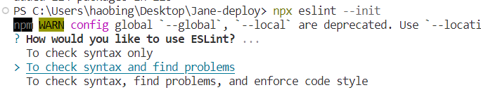

# 从0到1实现ci cd
自动化部署
## 1. npm init
 ```json
{
  "name": "jane-deploy",
  "version": "1.0.0",
  "description": "CI/CD server",
  "main": "index.js",
  "scripts": {
    "test": "echo \"Error: no test specified\" && exit 1"
  },
  "keywords": [
    "ci",
    "cd",
    "deploy"
  ],
  "author": "zuoxiaobai",
  "license": "MIT"
}
```
没有写git+respository
```json
"repository": {
    "type": "git",
    "url": "git+https://github.com/zuoxiaobai/js-deploy.git"
  },
```
## 2.  eslint init

## 2.1，安装 npm install eslint@7.32.0 --save-dev  
## 2.2 npx eslint --init 按照只是一步步操作  
   
选择了第二个，并且推荐我安装了：eslint-plugin-vue@latest  
## 2.3 npm install --save-dev --save-exact prettier    
## 2.4 npm install eslint-config-prettier --save-dev 处理eslint 与prettier的冲突  
## 2.5  npm install eslint-plugin-prettier --save-dev 将 prettier 以插件形式集成到 eslint 处理流程中
配置 [eslint-plugin-prettier](https://github.com/prettier/eslint-plugin-prettier)，实际我参考的是zuo-deploy的文件。  
## 3. koa koa-router koa-static
## 3.1 完成接口、静态服务  
postman可以访问 http://127.0.0.1:7777/user  
浏览器可以访问 http://127.0.0.1:7777/ 得到index.html页面  
## 4. 上传npm包
## 4.1 本地调试：
```js
npm exec  
npm link  
janedeploy start // 就成功了。
```  
## 4.2 上传npm包：
 1. 先切换到npm原镜像  npm config set registry https://registry.npmjs.org/
 2. npm adduser; npm login; npm publish
 3. 切回到淘宝镜像 npm config set registry https://registry.npm.taobao.org

## 5 杀死进程 
 杀不掉-守护进程  
## 6. 问题
0. 在virtual box上全局安装了 jane-deploy，sudo install -g jane-deploy  
1. 查看bin目录下是否有 janedeploy  
2. 建议重启终端 sudo reboot  
3. 查找wsl下的bin，也没有janedeploy，但是却可以启动成功janedeploy,是因为启动的vscode的终端是bash，而不是wsl
4. 查找janedeploy命令 和zuodeploy：which zuodeploy   
 4.1 在wsl下    
 4.2 在virtualbox的ubuntu下   
 4.3 在win下     
  4.3.1  win的路径 C:\\Users\\lala\\AppData\\Roaming\\npm  
  4.3.2  用两个反引号``包围``  即:`C:\Users\lala\AppData\Roaming\npm `

5.  readerme 换行失效，需要两个空格再换行
6. 如何在GitHub的readme中加图片   
  6.1  ``  
  6.2 ``  
  6.3  
```html
  
```
## 7. 在wsl-ubuntu 安装nginx
```js
sudo apt install nginx //安装  
//命令是 Systemd 的一个工具，用于管理系统服务的启动、停止和状态。
sudo systemctl start nginx//启动，http://172.28.9.198，nginx的hello页面
sudo systemctl stop nginx //停止
ps aux //查看当前运行的程序
ps -aux | grep <程序名称> 
npm list -g  //查找全局安装的npm包
rm /usr/bin/janedeploy //删除
program
 .commond() //解决在bin目录下没有janedeploy的方法：多加一个program
```
## 8 问题
```js
sudo npm link //提示错误：npm ERR! path /usr/bin/package.json
```
## 9. 逻辑
获取 ubuntu 本地的 nginx 配置到前端页面：
1. 前端发送请求
2. 后端接收请求，并且响应


